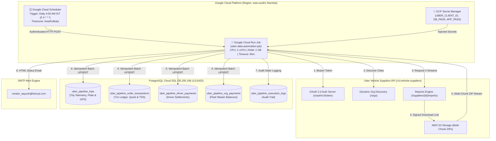

# LetzRyd Uber Data Pipeline — Master Knowledge Transfer (KT) & Architecture Guide

Welcome to the definitive **Engineering & Operations Knowledge Transfer (KT) Guide** for the **LetzRyd Uber Data Automation Pipeline**. This document provides an exhaustive, end-to-end breakdown of the architecture, data streams, database models, cloud orchestration, dynamic discovery mechanisms, operational procedures, and troubleshooting playbooks.

---

## 📑 Table of Contents
1. [Executive Summary & Purpose](#1-executive-summary--purpose)
2. [End-to-End System Architecture](#2-end-to-end-system-architecture)
3. [Dynamic City & Fleet Auto-Discovery](#3-dynamic-city--fleet-auto-discovery)
4. [The 4 Essential Uber API Data Streams](#4-the-4-essential-uber-api-data-streams)
5. [Database Architecture & Schema Reference](#5-database-architecture--schema-reference)
6. [Core Technical Mechanics & Resilience Engineering](#6-core-technical-mechanics--resilience-engineering)
7. [Scheduling Strategy & Non-Working Hours Rationale](#7-scheduling-strategy--non-working-hours-rationale)
8. [Automated Email Notification Engine](#8-automated-email-notification-engine)
9. [Historical Backfill Runbook](#9-historical-backfill-runbook)
10. [Google Cloud Platform (GCP) Deployment Manual](#10-google-cloud-platform-gcp-deployment-manual)
11. [Monitoring, Audit Logs & Troubleshooting Playbook](#11-monitoring-audit-logs--troubleshooting-playbook)

---

## 1. Executive Summary & Purpose

### 🎯 Business Objective
LetzRyd operates commercial EV and ICE fleets across multiple metropolitan hubs in India (Bangalore, Mumbai, Hyderabad, and expanding to new cities). Each day, thousands of passenger trips, financial transactions, Quest incentive bonuses, Fastag toll refunds, and statutory tax withholdings (TDS) occur across these fleets on the Uber platform.

### ⚙️ Pipeline Mission
To provide an **autonomous, self-healing, zero-manual-intervention data pipeline** deployed on **Google Cloud Platform (Cloud Run + Cloud Scheduler)** that:
1. Automatically discovers all operating cities/fleets registered under LetzRyd's Uber Supplier credentials.
2. Ingests all 4 essential Uber API reports daily at **4:00 AM IST (non-working hours)**.
3. Batch upserts clean, structured records into PostgreSQL with complete idempotency (zero duplicated rows, existing history remains intact).
4. Dispatches an automated executive email notification to `vendor_aayush@letzryd.com` with key operational KPIs upon run completion.

---

## 2. End-to-End System Architecture



---

## 3. Dynamic City & Fleet Auto-Discovery

### ❓ The Challenge
Hardcoding organization IDs or city names means that whenever LetzRyd expands to a new city (e.g. Delhi, Pune, Chennai) or creates a new sub-fleet (e.g. `BLR X`, `HYD VI`), developers would have to update and redeploy the code.

### 💡 The Dynamic Discovery Solution
In [`src/get_orgs.py`](file:///C:/Users/anura/.gemini/antigravity/scratch/uber/src/get_orgs.py), the pipeline calls:
```http
GET https://api.uber.com/v1/vehicle-suppliers/orgs
Authorization: Bearer <TOKEN>
```
Uber returns **all supplier entities** associated with the LetzRyd developer account across India.

```python
def get_operating_fleets(token=None):
    orgs = get_all_organizations(token)
    return sorted(orgs, key=lambda x: x.get("name", ""))
```

### 🌟 Future-Proof Guarantee
When a new city or vehicle hub is onboarded onto LetzRyd's Uber Supplier account, the pipeline **automatically discovers the new organization UUID**, generates the corresponding reports, and ingests the data into PostgreSQL without touching a single line of code!

---

## 4. The 4 Essential Uber API Data Streams

To fulfill all operational, telemetry, vehicle number plate, and financial requirements, the pipeline pulls **4 distinct API report streams**:

| Stream # | API `reportType` | Target Table | Primary Key | Key Data Points Captured |
| :--- | :--- | :--- | :--- | :--- |
| **Stream 1** | `REPORT_TYPE_TRIP_ACTIVITY` | `uber_pipeline_trips` | `trip_uuid` | Physical vehicle plate (`car_no`), driver name, GPS pickup & dropoff addresses, trip distance (km), status (`completed`, `rider_cancelled`), product tier (`UberGo`, `UberX`), passenger fare. |
| **Stream 2** | `REPORT_TYPE_PAYMENTS_ORDER` | `uber_pipeline_order_transactions` | `transaction_uuid` | Granular financial ledger, `vs reporting` timestamp, Quest promotions, vehicle-based bonuses, India TDS withholding (`-24.00`, `-20.00`), platform fees, Fastag toll credits, driver cash collections. |
| **Stream 3** | `REPORT_TYPE_PAYMENTS_DRIVER` | `uber_pipeline_driver_payments` | `(driver_uuid, org_name, window_start, window_end)` | Driver-level weekly/daily settlements, net fares, subscription fees, cash collected, and net bank payouts. |
| **Stream 4** | `REPORT_TYPE_PAYMENTS_ORGANIZATION` | `uber_pipeline_org_payments` | `(organization_uuid, window_start, window_end)` | Master hub accounting statement, start/end balances, gross revenues, airport/railway surcharges, and total bank disbursements. |

---

## 5. Database Architecture & Schema Reference

### 1. `uber_pipeline_trips`
```sql
CREATE TABLE uber_pipeline_trips (
    id                          BIGSERIAL PRIMARY KEY,
    trip_date                   DATE NOT NULL,
    trip_uuid                   VARCHAR(100) UNIQUE NOT NULL,
    driver_uuid                 VARCHAR(100),
    driver_name                 VARCHAR(255),
    vehicle_uuid                VARCHAR(100),
    car_no                      VARCHAR(50),           -- Vehicle Plate (e.g. MH01FE2240)
    service_type                VARCHAR(100),
    trip_request_time           TIMESTAMP,
    trip_drop_off_time          TIMESTAMP,
    pick_up_address             TEXT,                  -- Full GPS Pickup Address
    drop_off_address            TEXT,                  -- Full GPS Dropoff Address
    trip_distance               NUMERIC(10,2),
    trip_status                 VARCHAR(50),
    product_type                VARCHAR(100),          -- UberGo, UberX, etc.
    final_rider_fare            NUMERIC(10,2),
    payment_type                VARCHAR(50),
    rider_name                  VARCHAR(255),
    org_name                    VARCHAR(150),
    source_report_id            VARCHAR(100),          -- Uber API Report ID
    run_id                      VARCHAR(100),          -- Pipeline Execution ID
    report_fetch_window_start   TIMESTAMP,
    report_fetch_window_end     TIMESTAMP,
    ingested_at                 TIMESTAMP DEFAULT CURRENT_TIMESTAMP
);
```

### 2. `uber_pipeline_order_transactions`
```sql
CREATE TABLE uber_pipeline_order_transactions (
    id                          BIGSERIAL PRIMARY KEY,
    trx_date                    DATE,
    transaction_uuid            VARCHAR(100) UNIQUE NOT NULL,
    driver_uuid                 VARCHAR(100),
    driver_first_name           VARCHAR(100),
    driver_surname              VARCHAR(100),
    trip_uuid                   VARCHAR(100),
    description                 TEXT,                  -- Quest bonuses, TDS deductions, etc.
    organisation_name           VARCHAR(150),
    org_alias                   VARCHAR(150),
    reporting_time              TIMESTAMP,
    paid_to_you                 NUMERIC(12,2) DEFAULT 0,
    actual_earnings             NUMERIC(12,2) DEFAULT 0,
    cash_collected              NUMERIC(12,2) DEFAULT 0,
    refunds_toll                NUMERIC(12,2) DEFAULT 0,
    vehicle_number              VARCHAR(50),
    org_name                    VARCHAR(150),
    source_report_id            VARCHAR(100),
    run_id                      VARCHAR(100),
    report_fetch_window_start   TIMESTAMP,
    report_fetch_window_end     TIMESTAMP,
    ingested_at                 TIMESTAMP DEFAULT CURRENT_TIMESTAMP
);
```

### 3. `uber_pipeline_execution_logs`
```sql
CREATE TABLE uber_pipeline_execution_logs (
    id                      BIGSERIAL PRIMARY KEY,
    run_id                  VARCHAR(100) UNIQUE NOT NULL,
    run_type                VARCHAR(50) NOT NULL, -- 'DAILY_SCHEDULED', 'MANUAL_FORCE_RUN', 'HISTORICAL_BACKFILL'
    target_window_start     TIMESTAMP,
    target_window_end       TIMESTAMP,
    start_time              TIMESTAMP NOT NULL,
    end_time                TIMESTAMP,
    status                  VARCHAR(20) NOT NULL, -- 'RUNNING', 'SUCCESS', 'PARTIAL', 'FAILED'
    fleets_processed        INT DEFAULT 0,
    trips_inserted          INT DEFAULT 0,
    transactions_inserted   INT DEFAULT 0,
    drivers_inserted        INT DEFAULT 0,
    orgs_inserted           INT DEFAULT 0,
    error_message           TEXT,
    email_sent              BOOLEAN DEFAULT FALSE,
    created_at              TIMESTAMP DEFAULT CURRENT_TIMESTAMP
);
```

---

## 6. Core Technical Mechanics & Resilience Engineering

### 1. Active Queue Interception & Job Adoption
Uber's backend limits the number of concurrently queued reports per organization. Before making a `POST /reports` request, [`fetch_reports.py`](file:///C:/Users/anura/.gemini/antigravity/scratch/uber/src/fetch_reports.py) queries `/reports` for existing active or completed jobs matching the target date window. If a matching job exists, the pipeline adopts it immediately, eliminating queue backlog.

### 2. Multi-Chunk S3 ZIP Handling
For high-volume fleets, Uber partitions report downloads into ZIP archives containing multiple chunked CSVs (e.g. `-0.csv`, `-1.csv`). The `read_report_dataframe()` function detects ZIP byte signatures (`PK\x03\x04`), unzips all chunks in memory, and concatenates them into a unified Pandas DataFrame without disk thrashing.

### 3. 72-Hour Max Window Chunking (`MAX_CHUNK_HOURS = 72`)
Requesting date ranges larger than 7 days from Uber often results in backend timeouts (`REPORT_STATUS_FAILED`). The backfill engine automatically splits multi-week date intervals into 72-hour sliding chunks.

### 4. HTTP 429 Rate Limiting with Randomized Backoff
When Uber returns HTTP 429 (Too Many Requests), the generator applies exponential backoff with jitter:
$$\text{Wait Time} = 2^{\text{attempt}} \times 30\text{s} + \text{Random}(1, 10)\text{s}$$

### 5. Idempotent Batch UPSERTs (`psycopg2.extras.execute_values`)
Instead of slow row-by-row commits, the pipeline uses high-speed batch tuple arrays with `ON CONFLICT DO UPDATE`. Historical data is 100% protected against corruption or duplication.

---

## 7. Scheduling Strategy & Non-Working Hours Rationale

### ⏰ Configured Time: **4:00 AM IST** (`0 4 * * *` in `Asia/Kolkata`)

```text
00:00 IST ------------ 02:30 IST ------------ 04:00 AM IST ------------ 08:00 AM IST
[Day Ends]         [Uber Settlement]       [Pipeline Runs]          [Morning Shift Starts]
                      Finalized              Data Ingested &           Reports Ready on
                                            Email Dispatched             PostgreSQL
```

1. **Zero Portal Collision**: Operations staff is offline, eliminating rate-limiting conflicts from manual downloads.
2. **Finalized Ride Settlements**: Trips completed late at night are fully settled by Uber's systems before 3:00 AM.
3. **Operational Readiness**: The daily executive report is delivered to `vendor_aayush@letzryd.com` well before morning business operations commence.

---

## 8. Automated Email Notification Engine

Every scheduled run or manual trigger compiles execution metrics and sends an HTML summary email styled after the **LetzRyd Ola Automation** design:

* **Recipient**: `vendor_aayush@letzryd.com`
* **Sender**: `LetzRyd Uber Automation <vendor_aayush@letzryd.com>`
* **Visual Elements**:
  - Center LetzRyd logo emblem + `FLEET FINANCIAL OPERATIONS • UBER PIPELINE`.
  - Status pill badge (`STATUS: SUCCESSFUL` / `STATUS: FAILED`).
  - Metric summary card: `Trips Ingested`, `Financial Ledger Rows`, `Driver Settlements`, `Execution Duration`, and `Database Status: ACTIVE & COMMITTED`.
  - Action button linking to Cloud Run Console.
  - Error diagnostics box (if any stream failed).

---

## 9. Historical Backfill Runbook

The repository includes a dedicated CLI Backfill Engine ([`src/backfill.py`](file:///C:/Users/anura/.gemini/antigravity/scratch/uber/src/backfill.py)):

### Backfill Last 7 Days (Last Week)
```bash
python -m src.backfill --days 7
```

### Backfill Custom Date Range
```bash
python -m src.backfill --start 2026-08-10 --end 2026-08-25
```

---

## 10. Google Cloud Platform (GCP) Deployment Manual

### 1. Build and Push Docker Container
```bash
PROJECT_ID="letzryd-prod"
REGION="asia-south1"
IMAGE_NAME="asia-south1-docker.pkg.dev/${PROJECT_ID}/letzryd-apps/uber-pipeline:latest"

docker build -t ${IMAGE_NAME} .
docker push ${IMAGE_NAME}
```

### 2. Deploy Cloud Run Job
```bash
gcloud run jobs deploy uber-data-automation-job \
    --image=${IMAGE_NAME} \
    --region=${REGION} \
    --project=${PROJECT_ID} \
    --cpu=2 \
    --memory=2Gi \
    --max-retries=3 \
    --task-timeout=3600s \
    --set-env-vars=PGHOST=35.200.196.113,PGPORT=5432,PGDATABASE=postgres,PGUSER=postgres,SENDER_EMAIL=vendor_aayush@letzryd.com,RECIPIENT_EMAIL=vendor_aayush@letzryd.com \
    --set-secrets=UBER_CLIENT_ID=UBER_CLIENT_ID:latest,UBER_CLIENT_SECRET=UBER_CLIENT_SECRET:latest,PGPASSWORD=PGPASSWORD:latest,APP_PASSWORD=UBER_APP_PASSWORD:latest
```

### 3. Create Cloud Scheduler Trigger
```bash
gcloud scheduler jobs create http uber-daily-sync-scheduler \
    --location=${REGION} \
    --schedule="0 4 * * *" \
    --time-zone="Asia/Kolkata" \
    --uri="https://${REGION}-run.googleapis.com/apis/run.googleapis.com/v1/namespaces/${PROJECT_ID}/jobs/uber-data-automation-job:run" \
    --http-method=POST \
    --oauth-service-account-email="cloud-run-invoker@${PROJECT_ID}.iam.gserviceaccount.com"
```

### 4. How to Trigger a Manual Force Run in GCP
```bash
gcloud run jobs execute uber-data-automation-job --region=asia-south1
```
*(Force runs at any hour are completely safe and will not corrupt or duplicate data).*

---

## 11. Monitoring, Audit Logs & Troubleshooting Playbook

### Query Recent Pipeline Runs
```sql
SELECT 
    run_id,
    run_type,
    target_window_start::date AS target_date,
    start_time,
    end_time,
    status,
    fleets_processed,
    trips_inserted,
    transactions_inserted,
    drivers_inserted,
    email_sent
FROM uber_pipeline_execution_logs
ORDER BY start_time DESC
LIMIT 10;
```

### Check Ingestion Count for Yesterday
```sql
SELECT 
    COUNT(*) AS total_trips,
    COUNT(DISTINCT car_no) AS active_vehicles,
    COUNT(DISTINCT driver_uuid) AS active_drivers
FROM uber_pipeline_trips
WHERE trip_date = CURRENT_DATE - INTERVAL '1 day';
```

---

## 👨‍💻 Maintainer & Support
* **Repository**: [`https://github.com/aayush-letzryd/uber`](https://github.com/aayush-letzryd/uber)
* **Team**: LetzRyd Autonomous Data Infrastructure Team
* **Notification Email**: `vendor_aayush@letzryd.com`
