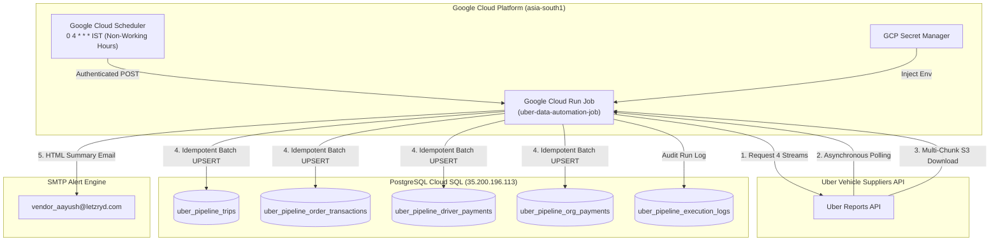

# LetzRyd Uber Data Pipeline (Autonomous GCP Service)

Production-grade, scheduled automated ETL pipeline designed to extract, normalize, and ingest **all 4 Uber Supplier API Data Streams** into PostgreSQL for LetzRyd's operating fleets across Bangalore (`BLR P`), Hyderabad (`HYD P`), and Mumbai (`MUM P`).

Target GitHub Repository: `https://github.com/aayush-letzryd/uber`

---

## 🏗️ 4-Stream Architecture



---

## ⏰ Optimal Timing: 4:00 AM IST (Non-Working Hours)

Running at **4:00 AM IST** guarantees:
1. **Zero Operational Conflict**: Operations team does not touch the Uber portal during this window, preventing manual report rate limit collisions.
2. **Data Finalization**: Uber's backend finalizes all ride settlement calculations for the preceding calendar day (which ends at 23:59:59 IST) by ~2:30 AM.
3. **Morning Readiness**: All trips, vehicle plates, transactions, Quest bonuses, and driver payouts are processed and ready in the database before the morning shift begins.

---

## 🛡️ Force Run & Idempotency Guarantee

If you manually trigger a force run in Google Cloud Run at **ANY hour** (e.g. 2 PM, 7 PM, etc.):
* **Zero Data Breakage**: Existing history stays 100% intact.
* **No Duplicate Rows**: Tables use natural composite primary keys (`ON CONFLICT DO UPDATE`).
* **Active Queue Interception**: The system checks Uber's server for existing active jobs before submitting new POST requests to avoid queue congestion.

---

## 🚀 Quickstart & Commands

### 1. Run Schema Migration
```bash
psql -h 35.200.196.113 -U postgres -d postgres -f sql/001_create_pipeline_tables.sql
```

### 2. Run Daily Ingestion Locally / Force Run
```bash
python -m src.runner
```

### 3. Backfill Last 7 Days (Last Week)
```bash
python -m src.backfill --days 7
```

### 4. Backfill Custom Date Range
```bash
python -m src.backfill --start 2026-08-15 --end 2026-08-25
```
