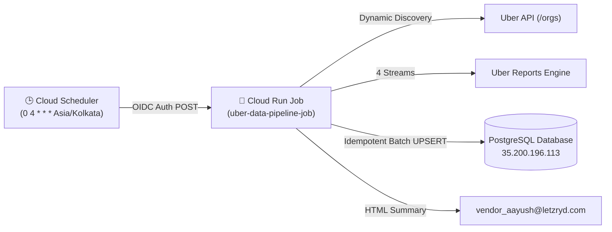

# LetzRyd Uber Automated Data Pipeline

Autonomous, self-healing data pipeline running on **Google Cloud Platform (Cloud Run Jobs + Cloud Scheduler)** that pulls all 4 essential Uber Vehicle Suppliers API streams daily at **4:00 AM IST (non-working hours)**, batch-upserts clean structured data into PostgreSQL, and sends executive HTML email reports to `vendor_aayush@letzryd.com`.

---

## 🌟 Key Features

* **Dynamic City / Fleet Auto-Discovery**: Automatically queries `/v1/vehicle-suppliers/orgs` so any newly onboarded city (e.g. Delhi, Pune, Chennai) or sub-fleet is synced automatically without code changes.
* **4-Stream Full Ingestion**:
  1. `REPORT_TYPE_TRIP_ACTIVITY` $\rightarrow$ `uber_pipeline_trips` (Vehicle plate `car_no`, driver UUID, GPS pickup/dropoff, distance, status, product tier, fare).
  2. `REPORT_TYPE_PAYMENTS_ORDER` $\rightarrow$ `uber_pipeline_order_transactions` (Txn UUID, Quest bonuses, vehicle incentives, India TDS withholdings).
  3. `REPORT_TYPE_PAYMENTS_DRIVER` $\rightarrow$ `uber_pipeline_driver_payments` (Driver weekly settlements).
  4. `REPORT_TYPE_PAYMENTS_ORGANIZATION` $\rightarrow$ `uber_pipeline_org_payments` (Master fleet balance statements).
* **Zero Duplicate Idempotency**: `ON CONFLICT DO UPDATE` ensures manual force runs or backfills never corrupt or duplicate history.
* **Resilient Uber API Architecture**: Active queue interception (no queue backlog), in-memory multi-chunk ZIP extraction, and HTTP 429 backoff with randomized jitter.
* **Executive HTML Email Notification**: Clean, professional operational summary matching LetzRyd branding delivered upon run completion.

---

## 🏗️ Architecture



---

## 🗄️ Database Tables (`postgres`)

| Table Name | Description | Natural Unique Key |
| :--- | :--- | :--- |
| **`uber_pipeline_trips`** | Full trip telemetry, physical car number plate (`car_no`), GPS routes | `trip_uuid` |
| **`uber_pipeline_order_transactions`** | Granular financial ledger, Quest bonuses, India TDS withholdings | `transaction_uuid` |
| **`uber_pipeline_driver_payments`** | Aggregated driver settlement summaries | `(driver_uuid, org_name, report_fetch_window_start, report_fetch_window_end)` |
| **`uber_pipeline_org_payments`** | Master organizational accounting statements | `(organization_uuid, report_fetch_window_start, report_fetch_window_end)` |
| **`uber_pipeline_execution_logs`** | Execution audit history & run metrics | `run_id` |
| **`uber_pipeline_sync_state`** | High-water mark state tracker | `(fleet_id, stream_name)` |

---

## 🚀 CLI & Operations Runbook

### 1. Run Pipeline for Yesterday (Default Scheduled Run)
```bash
python -m src.runner
```

### 2. Run Pipeline for a Specific Date
```bash
python -m src.runner --date 2026-08-24
```

### 3. Historical Backfill Engine
```bash
# Backfill last 7 days (auto-chunked in 72h windows)
python -m src.backfill --days 7

# Backfill custom date interval
python -m src.backfill --start 2026-08-10 --end 2026-08-25
```

---

## ☁️ Google Cloud Platform Deployment

### 1. Build Container (Google Artifact Registry)
```bash
gcloud builds submit --tag asia-south1-docker.pkg.dev/letzryd-dev-test/letzryd-apps/uber-pipeline:latest .
```

### 2. Deploy Cloud Run Job
```bash
gcloud run jobs deploy uber-data-pipeline-job \
    --image=asia-south1-docker.pkg.dev/letzryd-dev-test/letzryd-apps/uber-pipeline:latest \
    --region=asia-south1 \
    --cpu=2 \
    --memory=2Gi \
    --max-retries=3 \
    --task-timeout=3600s \
    --set-env-vars=PGHOST=35.200.196.113,PGPORT=5432,PGDATABASE=postgres,PGUSER=postgres,SENDER_EMAIL=vendor_aayush@letzryd.com,RECIPIENT_EMAIL=vendor_aayush@letzryd.com \
    --set-secrets=PGPASSWORD=PGPASSWORD:latest,UBER_ACCESS_TOKEN=UBER_ACCESS_TOKEN:latest,APP_PASSWORD=UBER_APP_PASSWORD:latest
```

### 3. Setup Cloud Scheduler (Daily 4:00 AM IST)
```bash
gcloud scheduler jobs create http uber-daily-sync-scheduler \
    --location=asia-south1 \
    --schedule="0 4 * * *" \
    --time-zone="Asia/Kolkata" \
    --uri="https://asia-south1-run.googleapis.com/apis/run.googleapis.com/v1/namespaces/letzryd-dev-test/jobs/uber-data-pipeline-job:run" \
    --http-method=POST \
    --oauth-service-account-email="uber-scheduler-sa@letzryd-dev-test.iam.gserviceaccount.com"
```

### 4. Trigger Force Run via GCP
```bash
# Force run for yesterday
gcloud run jobs execute uber-data-pipeline-job --region=asia-south1

# Force run for custom date
gcloud run jobs execute uber-data-pipeline-job --region=asia-south1 --args="--date=2026-08-24"
```

---

## 👥 Maintainers & Support
* **Team**: LetzRyd Data Infrastructure Team
* **Email**: `vendor_aayush@letzryd.com`
